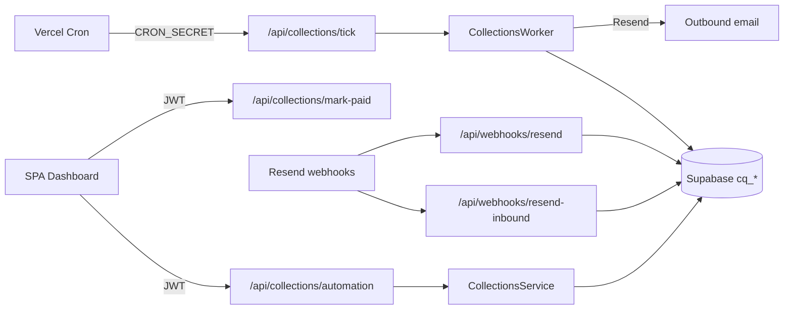

# Collections architecture

CollectQuiet collections automation is a reminder chase layer on top of invoices. It schedules email follow-ups, detects replies, pauses on human signals, and stops on payment — without becoming a full accounting system.

## System context

## Layers

| Layer | Responsibility |
|-------|----------------|
| **UI** (`src/main.ts`, `src/ui/*`) | Invoice form, setup, activation summary, detail card, Needs Attention |
| **API** (`server/api/*` → bundled to `api/*` at build) | Auth, feature flags, provider adapters |
| **Domain** (`src/collections/service.ts`) | State machine, activation, pause/resume, mark paid, promises |
| **Worker** (`src/collections/worker/tick.ts`) | Atomic claim, safety re-read, send / dry-run, retry |
| **Inbound** (`src/collections/inbound/*`) | Verify → dedupe → match → pause → classify → actions |
| **Email** (`src/collections/email/*`) | Compose, Resend provider, delivery webhooks, safety |
| **Flags / ops** (`flags.ts`, `observability/*`) | Controlled rollout, metrics, alerts |

## Data ownership

- All rows are scoped by `user_id` with RLS for browser clients.
- Worker / webhooks use the service role via `createSupabaseWorkerStore`.
- Cross-user access throws `cross_user_or_missing` (403 at API boundary).

## Controlled rollout

Production stays closed unless:

1. `COLLECTION_AUTOMATION_ENABLED=true`
2. User is on `COLLECTION_AUTOMATION_ALLOWLIST` (UUID or email; empty = deny all; `*` = all — staging only)
3. Real sends also require `COLLECTION_EMAIL_SENDING_ENABLED=true` and `COLLECTION_AUTOMATION_DRY_RUN=false`

See [collections-environment-variables.md](./collections-environment-variables.md) and [collections-runbook.md](./collections-runbook.md).

## Out of scope (current)

- WhatsApp automation channel
- PDF attachments on automated emails
- Live Stripe/Razorpay payment webhooks (mock route only, flag-gated)
- LLM classification in production (rules-first; optional later)
