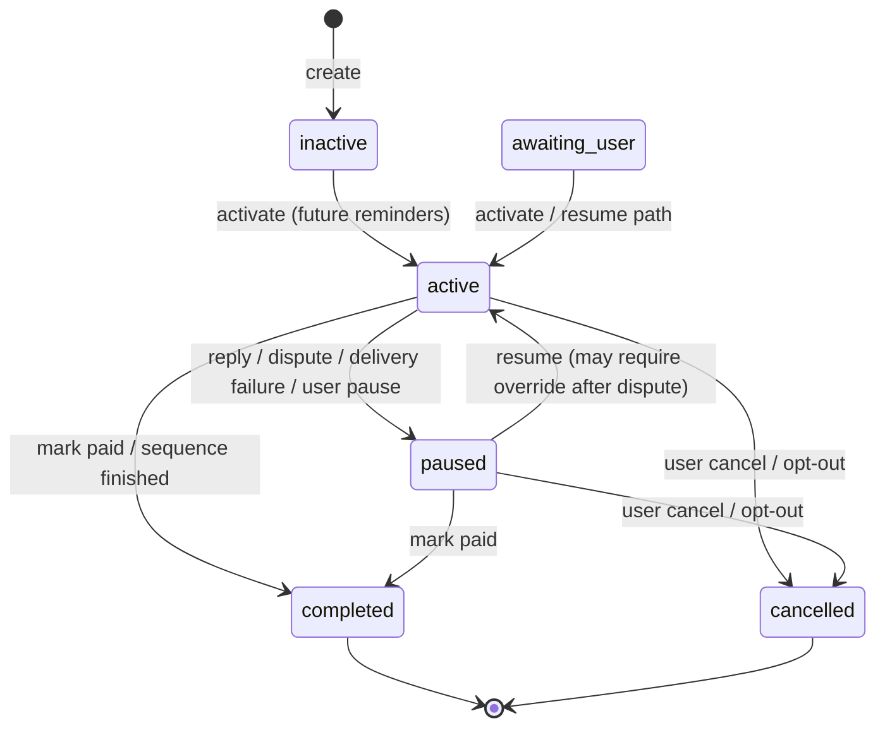

# Collections state machine

## Automation statuses

Terminal states (`completed`, `cancelled`) cannot reactivate. Restart = create a new automation.

## Reminder step statuses

`pending` → `processing` (claimed) → `sent` | `retry_scheduled` | `failed` | `skipped` | `cancelled`

Idempotency: `idempotency_key` unique; `reminder_sent` event + `provider_message_id` prevent duplicate provider sends.

## Invoice collection statuses (domain)

Typical progression: `open` → `collecting` → `paused` | `paid` | `disputed`.

Paid / disputed / opted-out invoices block further sends (worker + final safety check).

## Pause triggers

| Trigger | Effect |
|---------|--------|
| Client reply (matched) | Pause **before** classification completes actioning |
| Payment promise | Pause + Needs Attention / approval |
| Dispute | Pause + Needs Attention; resume needs confirmation |
| Bounce / complaint | Pause; complaint may set `opted_out` |
| Opt-out / unsubscribe | Cancel or pause + suppress contact |
| User pause | Pause with `user_paused` |

## Payment stop

`markInvoicePaid` is idempotent: invoice paid, automation `completed`, pending/retry/processing steps cancelled. Worker lease re-checks before and after provider send.

## Firm / final tones

Require `manualApprovedAt` (UI firm-approval checkbox or send-now confirm). Worker refuses firm tones without approval.
