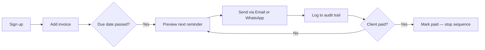
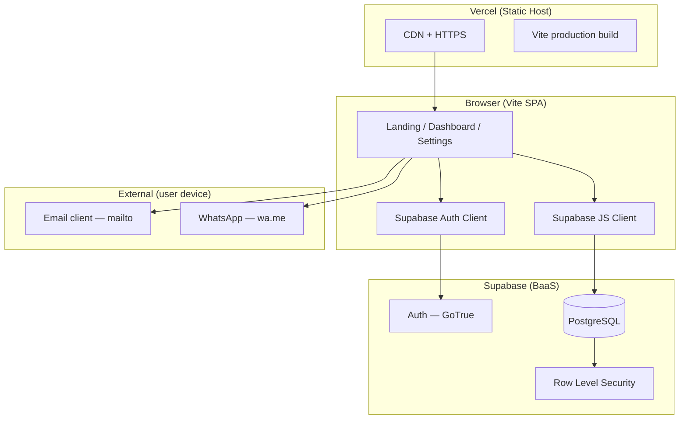
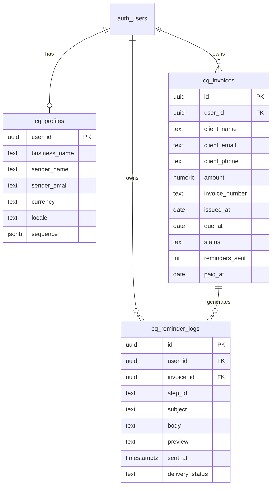

# CollectQuiet — Architecture & Business Document

**Version:** 1.0  
**Date:** 2026-07-12  
**Live product:** https://collectquiet.vercel.app  
**Status:** MVP published, India freelancer positioning

---

## 1. Executive Summary

**CollectQuiet** helps Indian freelancers and consultants get paid without the awkward invoice chase. Users log an invoice once, then send a calibrated sequence of polite → firm reminders via **email** or **WhatsApp** — with a full audit trail.

**One-line thesis:** Freelancers already did the work; chasing payment feels desperate and gets deferred until money is written off. CollectQuiet is the reminder layer, not accounting software.

**Target wedge:** Standalone follow-up tool for solo operators who invoice net-15/30 and communicate with clients on WhatsApp — not tradespeople who collect cash on-site.

---

## 2. Problem & Market

### 2.1 The pain

| Pain | Evidence |
|------|----------|
| Emotional friction — chasing feels "desperate" | [Indie Hackers, Mar 2026](https://www.indiehackers.com/post/chasing-overdue-invoices-is-awkward-i-built-a-small-tool-to-automate-reminders-4f89bae266) |
| Real money lost from not following up | Designer wrote off **$12,000** — [Dueflo IH post](https://www.indiehackers.com/post/i-built-an-ai-that-collects-overdue-invoices-for-quickbooks-users-looking-for-beta-testers-GvUXtcIzt3SEt9bfLP4l) |
| Friday afternoons spent chasing invoices | r/smallbusiness pattern (research dossier) |
| Builders shipping in this niche in 2026 | PayNudger, Dueflo, InvoiceBlitz — validated demand |

### 2.2 Why India / freelancers

- **Freelancers** (designers, developers, writers, consultants) invoice after delivery with 15–45 day terms.
- **WhatsApp** is the default client channel; email alone is weak in India.
- **Plumbers/electricians** often collect on completion — poor fit for invoice-chase software.
- Recovering **one** overdue invoice (₹15k–₹50k) pays for years of subscription.

### 2.3 Anti-persona

- Enterprise AR teams with NetSuite/SAP
- Cash-on-delivery trades
- Users who want full accounting (use Zoho Books / QuickBooks instead)

---

## 3. Solution

### 3.1 Product promise

> Get paid without the awkward chase.

### 3.2 Core user journey



### 3.3 v1 features (shipped)

| Feature | Description |
|---------|-------------|
| Auth | Email + password, password reset |
| Invoice CRUD | Client, email, phone, amount, dates, payment link |
| Status engine | Pending → due soon → overdue → paid |
| 5-step sequence | Friendly nudge → final notice |
| Email remind | Opens `mailto:` with pre-filled copy |
| WhatsApp remind | Opens `wa.me` with pre-filled message |
| Audit log | Every reminder stored with timestamp + preview |
| CSV export | Invoices + reminder log for disputes |
| Settings | Business name, sender, INR/USD |
| Landing | India pricing (₹499 / ₹999), social proof quotes |

### 3.4 v2 roadmap

| Priority | Feature | Why |
|----------|---------|-----|
| P1 | Server-side email (Resend/Postmark edge function) | No mail-client dependency |
| P1 | Auto-scheduled reminders (cron) | True automation vs manual click |
| P2 | Razorpay / UPI payment link tracking | India-native payments |
| P2 | WhatsApp Business API | Programmatic WA send |
| P3 | Accountant read-only portal | Referral channel |
| P3 | Hindi reminder templates | Localization |

---

## 4. Business Model

### 4.1 Pricing (India)

| Plan | Price | Includes |
|------|-------|----------|
| Trial | ₹0 / 14 days | Full feature access |
| Starter | ₹499/mo | 25 active invoices, email + WhatsApp |
| Pro | ₹999/mo | Unlimited invoices, auto-scheduling (planned), UPI tracking |

### 4.2 Unit economics (target)

| Metric | Target |
|--------|--------|
| Gross margin | 85%+ (email/WA opens are near-zero marginal cost in v1) |
| CAC | < ₹2,500 via organic (Reddit, IH, freelancer communities) |
| Payback | 1 recovered invoice |
| Churn risk | Low if user recovers money in month 1 |

### 4.3 Competitive positioning

| Competitor | Position | CollectQuiet difference |
|------------|----------|-------------------------|
| PayNudger | Early IH builder tool | Polished UX, WhatsApp, INR-native |
| Dueflo | QuickBooks AI collector, ~$49/mo | No QB required, lower price |
| Zoho Invoice / FreshBooks | Full accounting | Complement, not replace — "reminder layer only" |
| Manual spreadsheets | Free | Tone library + audit trail + sequence |

### 4.4 Go-to-market

1. **Validation posts** — Reddit, Indie Hackers (this phase)
2. **Design partners** — 10 freelancers who share overdue-invoice stories
3. **Content** — "How to follow up without sounding desperate" (WhatsApp templates)
4. **Accountant adjacency** — CAs who file taxes but don't chase AR
5. **Builder communities** — r/SideProject, r/indianstartups, Show HN

### 4.5 Messaging pillars

1. **"You earned it. We'll ask."** — removes personal awkwardness
2. **"No accounting software required"** — direct market gap
3. **"Paper trail if they get difficult"** — dispute-ready audit log
4. **"WhatsApp-native for India"** — channel fit

---

## 5. Technical Architecture

### 5.1 System overview



### 5.2 Stack

| Layer | Technology | Role |
|-------|------------|------|
| Frontend | Vite 8 + TypeScript | Single-page app, no framework overhead |
| Styling | Vanilla CSS | Brand tokens, responsive layout |
| Hosting | Vercel | Static deploy, SPA rewrites |
| Auth | Supabase Auth | Email/password, session JWT |
| Database | Supabase Postgres | Invoices, profiles, logs |
| Security | RLS policies | User can only access own rows |

### 5.3 Repository layout

```
Iteration_1/05_product/collectquiet/
├── src/
│   ├── main.ts          # SPA shell, views, event binding
│   ├── types.ts         # Invoice, settings, sequence types
│   ├── utils.ts         # Money format, templates, mailto/wa.me
│   ├── style.css        # Design system
│   └── lib/
│       ├── supabase.ts  # Client init (publishable key only)
│       ├── db.ts        # CRUD + CSV export
│       └── escape.ts    # XSS prevention
├── supabase/
│   ├── schema.sql       # Tables, RLS, triggers
│   └── migration_freelancer.sql  # INR, phone columns
├── vercel.json          # SPA fallback rewrite
└── vite.config.ts       # Env injection at build time
```

### 5.4 Data model



### 5.5 Reminder sequence engine

Default 5-step escalation:

| Step | Day offset | Tone | Purpose |
|------|------------|------|---------|
| r1 | +1 | Friendly | Gentle nudge |
| r2 | +7 | Friendly | Follow-up |
| r3 | +14 | Direct | Payment needed |
| r4 | +21 | Firm | Work pause warning |
| r5 | +30 | Final | Final notice |

Templates use `{{client_name}}`, `{{invoice_number}}`, `{{amount}}`, `{{due_date}}`, `{{payment_link}}`, `{{sender_name}}`, `{{business_name}}`.

**v1 delivery:** User clicks Email or WhatsApp → client app opens → reminder logged → `reminders_sent` incremented.

**v2 delivery:** Cron edge function checks overdue invoices and sends automatically.

### 5.6 Security model

| Concern | Mitigation |
|---------|------------|
| Data isolation | RLS on all tables — `auth.uid() = user_id` |
| XSS | `escapeHtml()` on all user-rendered strings |
| API keys in browser | Only **publishable (anon)** key in client bundle — expected for Supabase SPA |
| Service role key | Never in frontend; server-only for edge functions (v2) |
| Secrets in repo | `.env`, `.env.production` gitignored; examples use placeholders |
| Auth | Supabase JWT; protected views gated client-side + RLS server-side |
| HTTPS | Vercel TLS termination |

**Note for Reddit reviewers:** The Supabase project URL and publishable key appear in the browser bundle. This is standard for client-side Supabase apps. All data access is enforced by Row Level Security — users cannot read other users' invoices.

### 5.7 Deployment pipeline

```
Developer → git push / vercel deploy
         → Vercel runs npm install && npm run build
         → Vite injects VITE_SUPABASE_* from env
         → dist/ served via CDN
         → vercel.json rewrites all routes to index.html (SPA)
```

**Environment variables (Vercel Production):**
- `VITE_SUPABASE_URL`
- `VITE_SUPABASE_ANON_KEY`

Never set `service_role` in Vercel or any client-visible env.

---

## 6. Operations & Compliance

### 6.1 Legal positioning

- CollectQuiet is **not** a collections agency — it helps users send their own reminders
- Users remain responsible for compliance with local communication and debt-collection norms
- Audit log supports dispute resolution; not legal advice

### 6.2 Support model (bootstrap)

- Email support via founder inbox
- In-app toast errors for API failures
- CSV export for user self-service records

### 6.3 Key metrics

| Metric | Why it matters |
|--------|----------------|
| Signups / week | Validation signal |
| Invoices added / active user | Activation |
| Reminders sent / user | Core value delivery |
| ₹ recovered (self-reported) | Outcome metric |
| 30-day retention | Product-market fit |

---

## 7. Risk Register

| Risk | Likelihood | Impact | Mitigation |
|------|------------|--------|------------|
| Fast-follower in validated niche | High | Medium | Win on India/WhatsApp UX + tone library |
| Email deliverability at scale | Medium | High | v2: transactional provider + domain auth |
| Users expect full accounting | Medium | Low | Clear positioning on landing page |
| WhatsApp API policy changes | Low | Medium | mailto/wa.me deep links as v1 fallback |
| Low willingness to pay in India | Medium | High | Price at ₹499; prove ROI with one recovery |

---

## 8. 90-Day Plan

| Phase | Weeks | Goal |
|-------|-------|------|
| Validate | 1–2 | Reddit/IH posts, 50 signups, 10 interviews |
| Refine | 3–4 | Template tuning, WhatsApp flow polish |
| Monetize | 5–8 | Razorpay billing, first 20 paying users |
| Automate | 9–12 | Scheduled reminders, server-side email |

**Success criterion for validation:** ≥30% of interviewed freelancers say they have sent an awkward "just checking on the invoice" message in the last 90 days.

---

## 9. Appendix

### A. Evidence index

- PayNudger / awkward chase: https://www.indiehackers.com/post/chasing-overdue-invoices-is-awkward-i-built-a-small-tool-to-automate-reminders-4f89bae266
- $12k write-off: https://www.indiehackers.com/post/i-built-an-ai-that-collects-overdue-invoices-for-quickbooks-users-looking-for-beta-testers-GvUXtcIzt3SEt9bfLP4l

### B. Related internal docs

| Doc | Path |
|-----|------|
| Business design (original) | `03_business/business_design.md` |
| Brand guidelines | `04_brand/brand_guidelines.md` |
| Final package | `07_final/PACKAGE.md` |
| Build log | `BUILD_LOG.md` |
| Supabase schema | `05_product/collectquiet/supabase/schema.sql` |

### C. Glossary

| Term | Meaning |
|------|---------|
| Reminder layer | Software that only handles follow-up, not invoicing or books |
| Publishable key | Supabase client key safe for browsers when RLS is enabled |
| Sequence | Ordered set of reminder templates with escalating tone |

---

*Document owner: CollectQuiet / Iteration 1*  
*Next review: after Reddit validation round*
